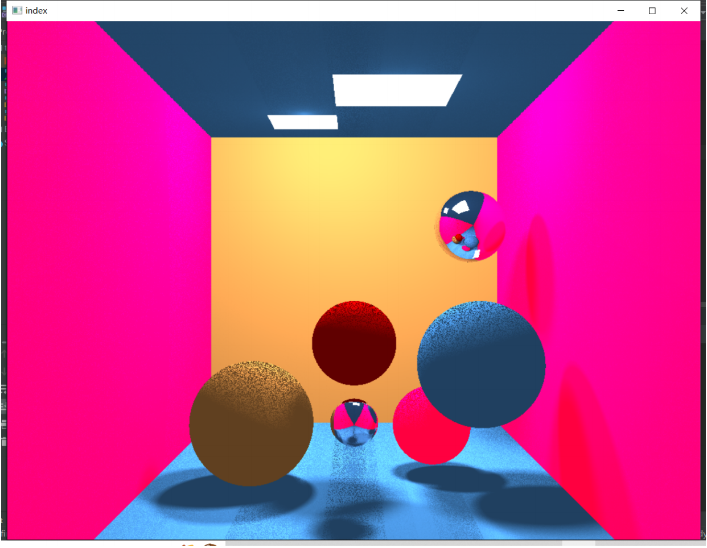
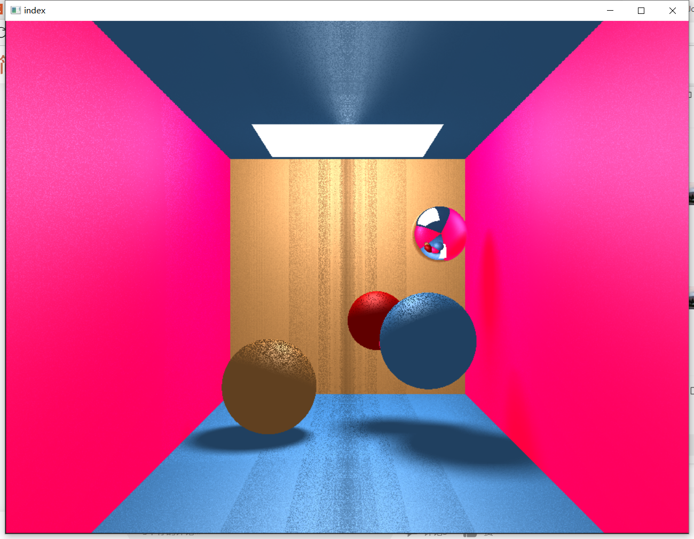
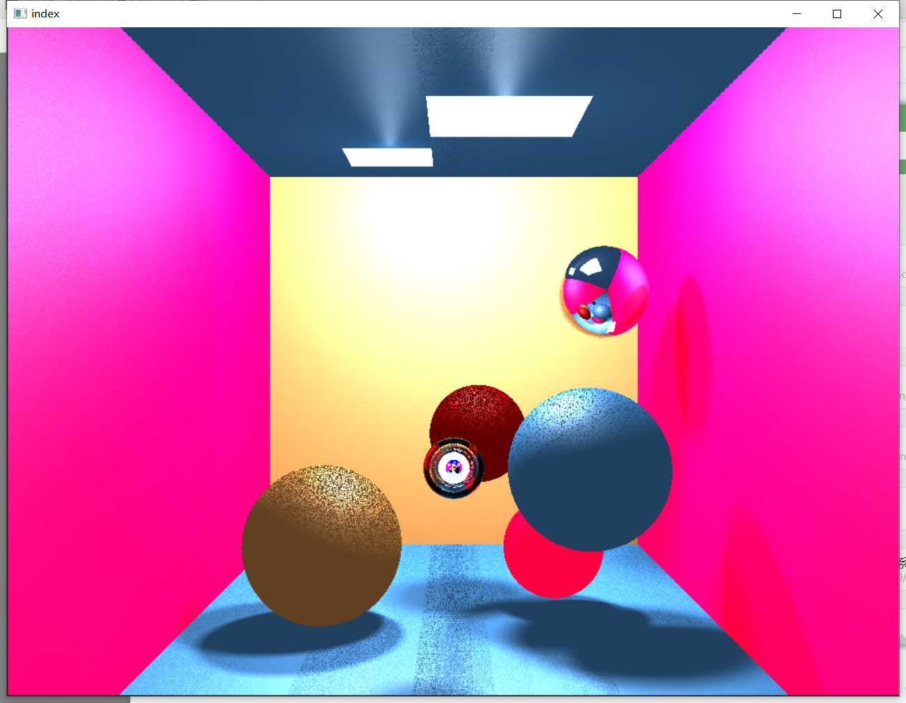

# An implement of Ray Tracing algorithm

#### 运行方法

原地运行tcode/cmake-build-debug/tcode.exe文件即可看到效果。

或将tcode.exe，shader.fs，shader.vs和3个.dll文件放在同一个目录下也可运行

修改文件后可以按照cmakelist进行编译

#### 代码说明

使用的方法为光线追踪。

在my_math.h中定义了Vector3f，即float[3]，用来存储三维向量，并使用inline定义了其对应的不同计算方法（有许多没有被用到的多余函数是之前尝试写别的任务遗留的）。

在objects.h中定义了两种物体：无限大平面和球，都继承自基类MyObject并且分别实现了对应的的Hit函数用于求光线与其的相交关系，会返回一个结构体Hit，记录了是否相交、交点坐标、法线、距离和材质。同时定义了3种材质，粗糙型、反射型和折射型（折射型物体目前还有bug）。还有

在main.cpp中定义

主函数main：初始化、加载shader、光追、绘制

ReadFile、AddShader和CompileShaders共同完成着色器的加载。

Render函数是绘制函数，最后调用，接收已经被存放在缓存里的数据进行绘制

initScene：初始化场景信息，设置相机位置、环境光、光源、往场景内放置物体。

CreateVertexBuffer：对于每一个像素点，根据相机位置调用trace函数计算光追信息，将返回信息和该点坐标记录并传入缓存用于绘制。

trace：核心函数，传入函数，追踪，返回这个光线应该得到的颜色信息。主要分为几步：1、判断是否达到递归上限，达到则返回环境光。2、对于每个物体和光源判断是否有相交，最后选择最近的相交物体（如果为光源则直接返回光源的光照信息）。3、如果相交材质是粗糙，则调用calLightIntensity计算该点的照明，并返回镜面反射和漫反射的叠加亮度。4、如果相交材质是反射，则递归调用函数计算反射光。5、如果相交材料是折射，则计算反射的同时递归调用计算折射光（还不完善）。

#### 运行效果

1、.exe最终效果：双光源、4个不同颜色球、2个反射球和5个平面。

2、单光源、4个不同颜色球（粉球被遮挡）、1个反射球和5个平面。

3、测试版，中间的反射球改成折射球，效果不太好

